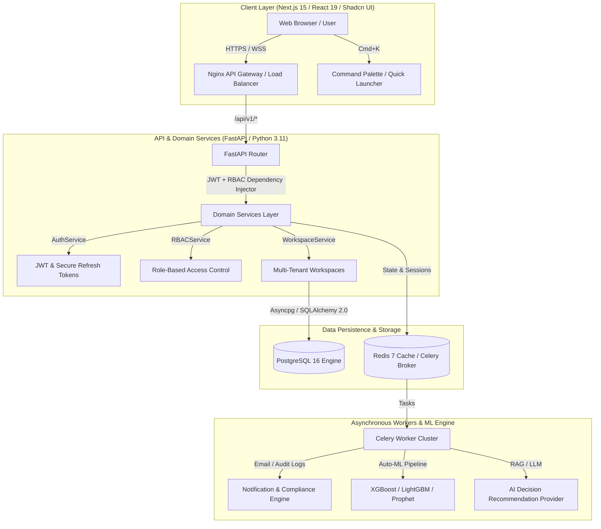

# DecisionOS — AI Decision Intelligence Platform
### *Enterprise-Grade SaaS Platform for Automated Business Insights, Forecasting, and AI Recommendations*

[](https://nextjs.org/)
[](https://react.dev/)
[](https://fastapi.tiangolo.com/)
[](https://www.python.org/)
[](https://www.postgresql.org/)
[](https://redis.io/)
[](https://www.docker.com/)
[](https://opensource.org/licenses/MIT)

---

## 🌟 Executive Overview

**DecisionOS** is an enterprise-grade AI Decision Intelligence SaaS Platform designed to transform raw business datasets into actionable recommendations, dynamic forecasts, real-time anomaly alerts, and executive-ready reports. Built from the ground up with clean Domain-Driven Design (DDD), secure multi-tenancy, and high-throughput machine learning pipelines, DecisionOS rivals enterprise analytics leaders like **Tableau**, **Power BI**, and **ThoughtSpot**.

---

## 🏗️ System Architecture & Data Flow



---

## 🚀 Key Enterprise Capabilities

1. **Enterprise Authentication & SSO**
   - Stateless JWT access token authentication paired with database-backed secure refresh token rotation and revocation.
   - Built-in Google Workspace OAuth identity SSO support.
   - Passwordless magic login link support via Celery workers.

2. **Granular Role-Based Access Control (RBAC)**
   - Granular permission tag matrix (`owner`, `admin`, `editor`, `viewer`).
   - Wildcard permission evaluation (`*` for Owners, domain wildcards like `dataset:*` for Admins).
   - Enforced at the API route dependency layer (`@RequirePermission("dataset:write")`).

3. **Multi-Tenant Organization & Workspace Isolation**
   - Clean data isolation by `organization_id` and `workspace_id`.
   - Automatic bootstrap of default **Main Workspace** and default system roles on organization registration.
   - Header-driven (`X-Organization-Id`) or slug-based (`/dashboard/[slug]`) tenant switching.

4. **Extensible AI Decision Intelligence Engine**
   - Clean OOP abstract interfaces for Auto-ML (`REGRESSION`, `CLASSIFICATION`, `FORECASTING`, `ANOMALY_DETECTION`).
   - Built-in telemetry recorder tracking inference latency, row throughput, and model execution metrics.

---

## 📦 Monorepo Folder Structure

```
DecisionOS/
├── backend/                  # FastAPI 0.115 + Python 3.11 Backend
│   ├── app/
│   │   ├── api/v1/endpoints/ # REST API Controllers (Auth, Users, Orgs, Workspaces)
│   │   ├── core/             # Settings, JWT Security, Custom Exception Handlers
│   │   ├── db/               # SQLAlchemy 2.0 Async Session & Base Mixins
│   │   ├── models/           # Domain Entities (User, Organization, Workspace, AuditLog)
│   │   ├── repositories/     # Data Access Layer (UserRepository, OrgRepository, WorkspaceRepository)
│   │   ├── services/         # Domain Logic Layer (AuthService, RBACService, WorkspaceService)
│   │   ├── schemas/          # Pydantic v2 Request & Response Schemas
│   │   ├── ml/               # Machine Learning & AI Decision Engine Interfaces + Telemetry
│   │   └── workers/          # Celery App & Async Tasks (Email, Compliance Audit)
│   ├── alembic/              # Async PostgreSQL Migration Scripts
│   ├── tests/                # Pytest Async Integration & Unit Test Suite
│   └── pyproject.toml        # Backend Dependencies & Lint Configuration
│
├── frontend/                 # Next.js 15 (App Router) + React 19 Frontend
│   ├── src/
│   │   ├── app/              # (auth)/login, (auth)/register, (dashboard)/[slug], (dashboard)/[slug]/settings
│   │   ├── components/       # Shadcn Glassmorphic UI Primitives, TopNavbar, AppSidebar, CommandPalette
│   │   ├── hooks/            # TanStack React Query Hooks (useAuth, useWorkspace, useKeyboardShortcut)
│   │   ├── lib/              # Axios API Client with Auto-401 Token Refresh Interceptor & cn utility
│   │   └── store/            # Zustand Client State Store (Active Tenant, Workspaces, Theme)
│   ├── tailwind.config.ts    # SaaS Design System Variables, Micro-animations, Glassmorphism
│   └── package.json          # Frontend Dependencies & Build Scripts
│
├── docker/                   # Multi-stage production Dockerfiles & Nginx Config
│   ├── backend.Dockerfile    # Non-root runtime Python 3.11-slim container
│   ├── frontend.Dockerfile   # Non-root Next.js standalone runner container
│   └── nginx.conf            # Reverse proxy routing /api/ to backend and / to frontend
│
├── docker-compose.yml        # Multi-container orchestration (PostgreSQL, Redis, Backend, Worker, Frontend, Nginx)
├── .github/workflows/ci.yml # GitHub Actions Continuous Integration (Lint, Test, Docker Build)
└── README.md                 # Complete documentation & quickstart guide
```

---

## ⚡ Quickstart Guide (Local Development & Docker Compose)

### 1. Prerequisite Checklist
- **Docker & Docker Compose** (v2.20+ recommended)
- **Node.js** (v20+ LTS) & **Python** (v3.11+) if running outside containers

### 2. Launch Entire Platform via Docker Compose
To build and start PostgreSQL 16, Redis 7, Backend FastAPI, Celery Background Worker, Next.js 15 Frontend, and Nginx reverse proxy:

```bash
docker compose up --build -d
```

Once running, access the services at:
- **Web SaaS Application**: `http://localhost` (or `http://localhost:3000` directly)
- **FastAPI OpenAPI Swagger Docs**: `http://localhost:8000/docs`
- **ReDoc Interactive Documentation**: `http://localhost:8000/redoc`
- **Health Check Endpoint**: `http://localhost:8000/api/v1/health`

### 3. Running Backend Tests (Pytest)
To execute the automated backend unit and integration test suite:

```bash
cd backend
python -m pytest tests/ -v
```

---

## 🗺️ Incremental Development Roadmap

| Module | Name | Focus & Highlights | Status |
| :---: | :--- | :--- | :---: |
| **01** | **Foundation & Architecture** | Monorepo setup, Authentication (JWT), RBAC, Multi-tenancy, Clean Architecture, CI/CD, Pytest | 🟢 **COMPLETED** |
| **02** | **Data Ingestion & Pipelines** | Async CSV/Excel upload, Celery background streaming, automatic schema inference, DuckDB OLAP engine | 🟡 **PLANNED** |
| **03** | **Automated Data Cleaning** | ML outlier detection, missing value imputation, type coersion, dataset version control (Git-like) | 🟡 **PLANNED** |
| **04** | **AI-Generated Dashboards** | NLP-to-SQL visualization, Shadcn/Recharts auto-charts, drag-and-drop widget layout, KPI tracking | 🟡 **PLANNED** |
| **05** | **Auto-ML & Forecasting Engine** | Automated XGBoost/LightGBM model selection, Prophet time-series forecasting, SHAP explainability | 🟡 **PLANNED** |
| **06** | **AI Decision Intelligence Engine** | LLM + RAG business recommendation generator, confidence score modeling, impact simulation | 🟡 **PLANNED** |
| **07** | **What-If Scenario Simulator** | Parameter slider simulation, revenue impact sensitivity charts, risk vs. reward forecasting | 🟡 **PLANNED** |
| **08** | **AI Assistant & Reports** | Contextual RAG Chatbot ("Why did Q2 sales drop?"), automated executive PDF report generator | 🟡 **PLANNED** |
| **09** | **Enterprise Alerts & Polish** | Webhook alerting (Slack/Email), automated anomaly notification triggers, production hardening | 🟡 **PLANNED** |

---

## 🔒 Security & Compliance
- **Zero-Trust Token Rotation**: Refresh tokens are stored with secure SHA-256 hashes or database revocation tables.
- **Non-Root Containers**: Both Backend and Frontend Docker containers run under dedicated UID/GID `1000`/`1001` accounts.
- **Audit Logging**: Every sensitive workspace mutation triggers an audit event logged via asynchronous Celery workers.

---

## 📄 License
This project is licensed under the **MIT License**. See `LICENSE` for details.
